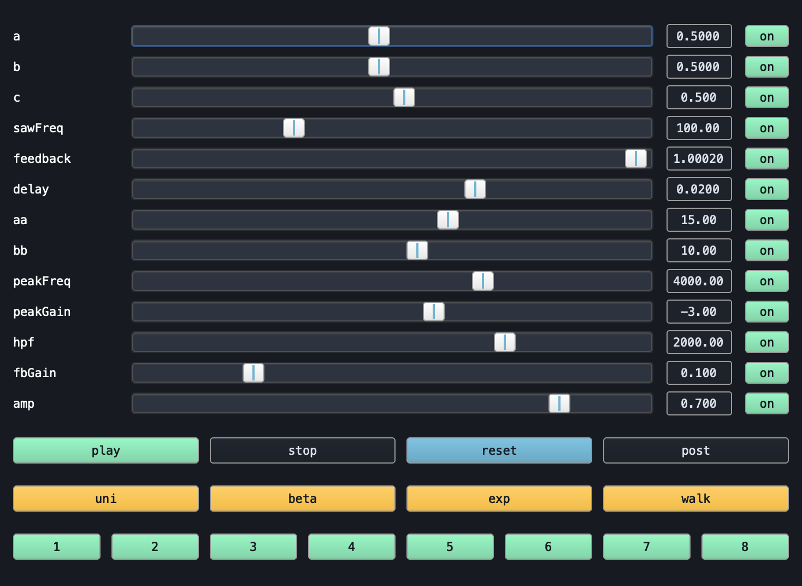
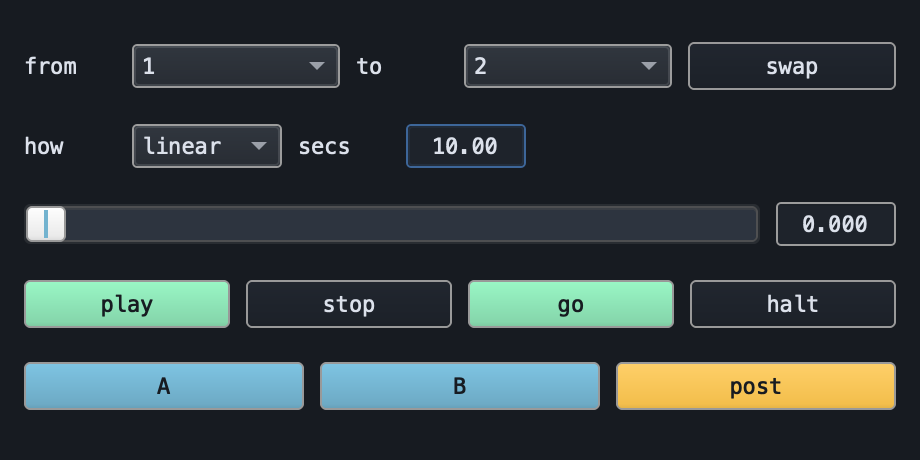
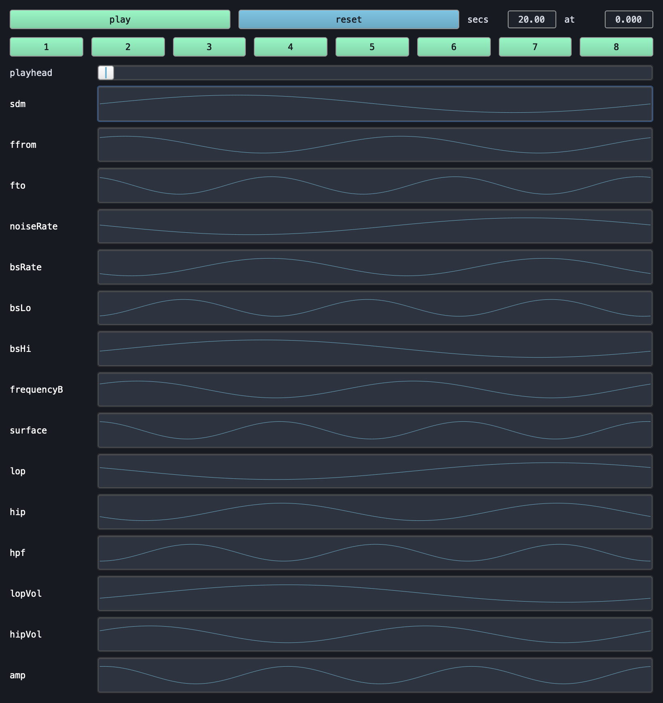

# Genesis

Genesis explores a set of sound synthesis procedures built from stochastic, chaotic and network-based functions and a set of tools for playing them: faders, presets, morphing between presets, and workflows that process or resonate the material.



## Running it

Open `core/example.scd` and work down the blocks. The first one loads everything:

```supercollider
~here = thisProcess.nowExecutingPath.dirname +/+ "../";
(~here ++ "core/material-library.scd").load;   // ~material, ~gen, ~play, ~solo, ~free, ~loaded
(~here ++ "core/fader-specs.scd").load;        // ~specs
(~here ++ "core/ndef-faders.scd").load;        // ~ndefFaders
(~here ++ "core/preset-morph.scd").load;       // ~loadPresets, ~presetMorph
~presets = ~loadPresets.(~here ++ "core/presets.scd");
```

Then `~play.(\gorse)` to hear one, `~free.()` to put everything back to sleep.

## The tools

Fader window: a slider per parameter, four randomize distributions, eight preset slots.

Morph window: travel from one preset to another, nine ways, over a duration.



Curve window: one 512-point trajectory per parameter, walked over one duration.



## The files

- `core/material-library.scd`: the ten processes as source functions, instantiated on demand
- `core/fader-specs.scd`: the fader range per parameter
- `core/ndef-faders.scd`, `core/ndef-curves.scd`, `core/preset-morph.scd`: the three windows
- `core/*-setups.scd`: one block per process, opens its window
- `core/presets.scd`: posted states, one line each; `//` and `/* */` take one out of the set
- `core/selection-principles.scd`: Koenig's six selection principles from SSP, and `~ssp`, which builds a process from a LIST / SELECT / SEGMENT / PERMUTATION plan
- `workflows/wf-*.scd`: granulation, sediment, waveset, feedback, resonance
- `workflows/of/`: processes woven together through OF's `.stack`/`.transform` chains
- `spatial/spatialisers.scd`: five ways of putting a 4-channel process into 8 channels

## Worth knowing

- Handles are called method-style: `~faders[\gorse].randomize(\beta)`, `~morph.go(3, \zigzag, 20)`. Dot access on an Event calls the function it finds, so `.randomize.(\beta)` silently drops the argument.
- `Cyclegen` fixes `knum` and `freqs` at build time, so fern's `knumFrom`/`knumTo` only bite on the next `~gen.(\fern)`.
- Preset blending happens in fader space, so an `\exp` parameter glides geometrically. That needs `~specs`; without it the blend is linear.
- All ten processes are `NF`, the OF library's `Ndef` subclass, so any of them can `.stack`/`.transform`.
- Summing two processes and stacking OF filters adds up fast: trim `amp` when performing.
